# Dovry-Game
Repositorio del proyecto de Unity de Dovry Game. Este repositorio contiene todos los elementos y archivos relacionados con el proyecto de Unity asociado a "Dovry-Game". Para descargar este repositorio se debe tener Git y Unity instalados.

# Instalación de dependencias

A continuación podemos ver cómo obtener y utilizar las herramientas necesarias para correr el proyecto. Si problemas son encontrados en el proceso, hablar con Gato.

## [0.0] Git - GitHub - Github Desktop

Git es una herramienta de sincronización de versiones de trabajo y elementos digitales. En términos simples, Git se encarga de que todos tengan los mismos archivos, haciendo que si un desarrollador cambia código en un archivo, sube un nuevo archivo o mueve archivos entre carpetas, Git facilita el hacer que todos esos cambios se mantengan sincronizados entre todos los integrantes del proyecto.

## [0.1] Git

Git es una herramienta que se instala en Windows. Se puede obtener por medio del siguiente link de descarga:

https://git-scm.com/install/windows

(El proceso de instalación de Git te pedirá tomar muchas decisiones, pero utilizar lo ya seleccionado está perfecto; que no los amenacen tantas preguntas).

### ¿Cómo saber si ya tienes git?

1- Abre una terminal de comandos básica de Windows, conocida como "Símbolos del sistema"

(Se puede buscar la terminal de comandos escribiendo "cmd" en el buscador de la barra de Windows)

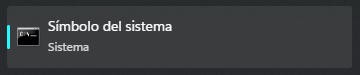

2- Corre el comando "git"

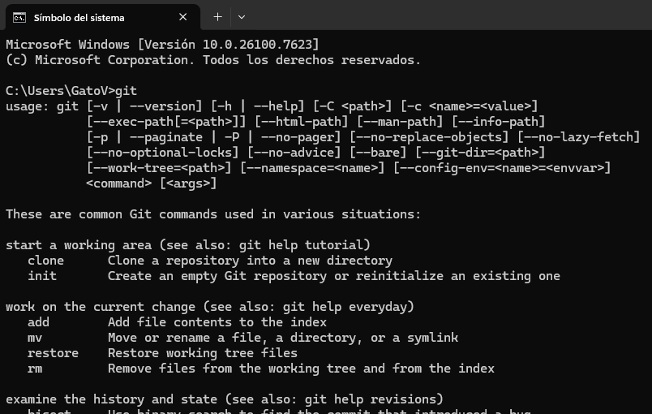

Si tienes Git instalado, se mostrarán una gran cantidad de comandos; si no lo tienes, solo verás un aviso de que el comando "Git" no se pudo reconocer.

## [0.2] GitHub

Git son herramientas de Windows, GitHub es la página que entrega el servicio de control de versiones y sincronización. Se puede acceder a GitHub por medio del siguiente link:

https://github.com/

(Aunque, bueno, esto lo estás viendo en GitHub).

Necesitarás una cuenta de GitHub para poder descargar "Repositorios" de otras personas y, más importante, este repositorio de código. Así que hazte con una cuenta de GitHub; puedes utilizar un correo personal o institucional, ya que GitHub es una herramienta profesional de desarrollo.

Una vez que tengas tu cuenta de GitHub, compártela con Gato para que te añada al proyecto y tengas permiso de descargarlo.

## [0.3] GitHub Desktop

Git son las herramientas, GitHub es la página y servicios, "GitHub Desktop" es... ¿La mesa de trabajo?

GitHub Desktop es una aplicación para nuestros computadores que facilita usar Git, ya que Git originalmente se utiliza en una terminal de comandos. GitHub Desktop llegó para hacer el proceso de usar Git mucho menos amenazante para nuevos usuarios o para usuarios que no tienen experiencia informática, para que no trabajen con miedo sobre algo que no está diseñado para usuarios ajenos a proyectos informáticos.

GitHub Desktop se puede obtener por medio del siguiente link:

https://desktop.github.com/download/

Una vez que inicies GitHub Desktop, debería pedirte iniciar sesión con una cuenta de GitHub; ahí inicias sesión con tu cuenta hecha en la sección anterior. 

Si no se te pidió iniciar sesión, puedes iniciar sesión en GitHub Desktop desde las opciones.

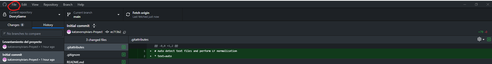

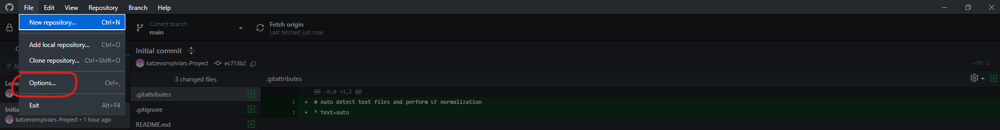

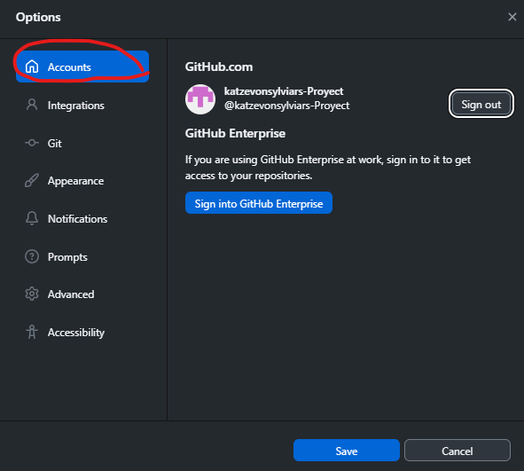

## [0.4] Unity / UnityHub

Unity... No sé mucho sobre él; es un framework (conjunto estandarizado de herramientas de desarrollo listo para llegar y montar proyectos rápidamente) diseñado para desarrollar videojuegos. Unity es muy flexible; con ello trae ventajas como desventajas, pero no es lo importante aquí. 

Unity es nuestra plataforma de desarrollo de videojuegos que une código lógico con diseños en productos finales funcionales.

Puedes hacerte con Unity en el siguiente link:

https://unity.com/es/download

NOTA: Puede que tengan que hacerse una cuenta para la aplicación de Unity.

## [0.5] Terminando la instalación

Para continuar, deberías tener lo siguiente:

- Git instalado en tu computador
- Una cuenta de GitHub
- (Opcional/Recomendado) GitHub Desktop instalado con tu cuenta de GitHub
- Unity Hub instalado

# [1.0] Montando el proyecto

En esta sección se verá todo lo relacionado con instalar el proyecto con las herramientas ya instaladas.

## [1.1] Descagar el proyecto
Lo primero es descargar el proyecto existente; esto se puede hacer fácilmente con Git.

1 -  Buscar la carpeta de proyectos de Unity

1.1 En Unity ve a la ventana de "Proyectos"

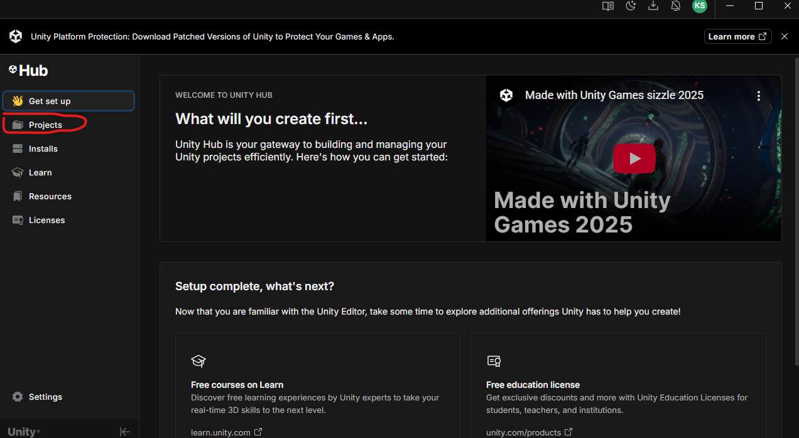

1.2 - Desde la ventana Proyectos, selecciona "Nuevo Proyecto"

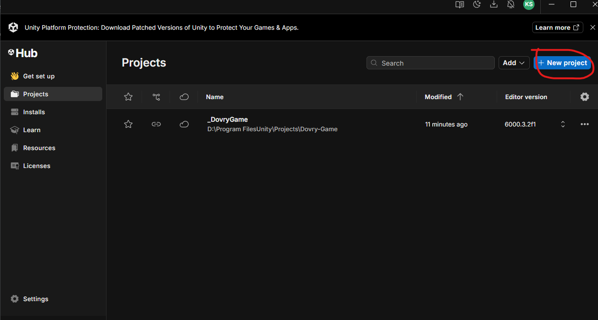

1.3 Desde la ventana de creación, podrás ver la localización predeterminada; aprieta en el botón de explorador de archivos para abrir la carpeta.

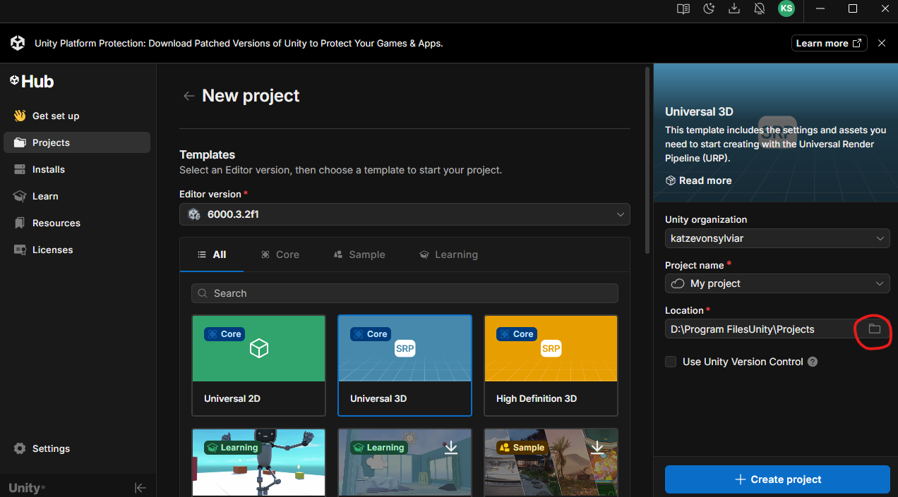

1.4 - Con esto, deberías estar con una carpeta vacía con la ruta que veías desde Unity. Mantenla abierta para continuar.

2 - Clonar el repositorio de Git

Ahora que sabemos dónde está la carpeta de proyectos de Unity, sabemos dónde bajar el repositorio.

2.1 - Abre GitHub Desktop; desde ahí, selecciona clonar repositorio desde internet.

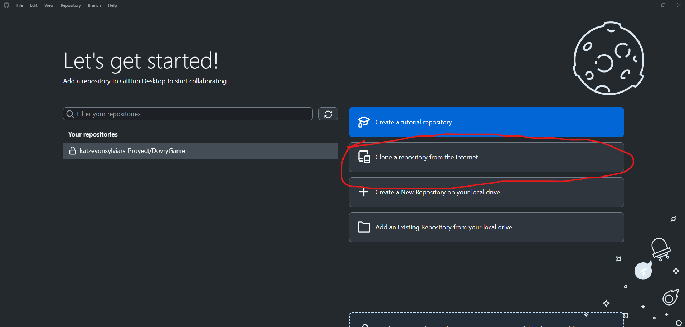

Desde la ventana de clonar, utilizaremos la opción de "URL" y utilizaremos la URL del repositorio:

URL: https://github.com/katzevonsylviars-Proyect/DovryGame.git

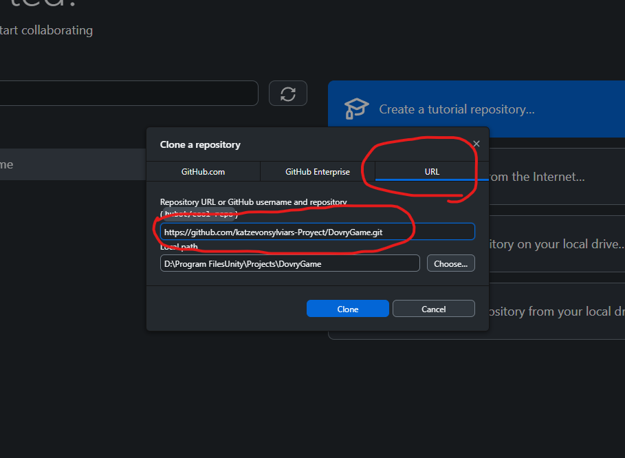

Como dirección objetivo colocaremos la carpeta de proyectos de Unity

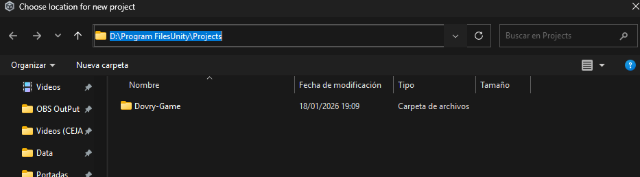 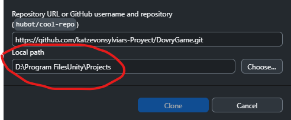

Después de la descarga, GitHub Desktop cambiará para mostrar el repositorio; puede verse así (no exactamente).

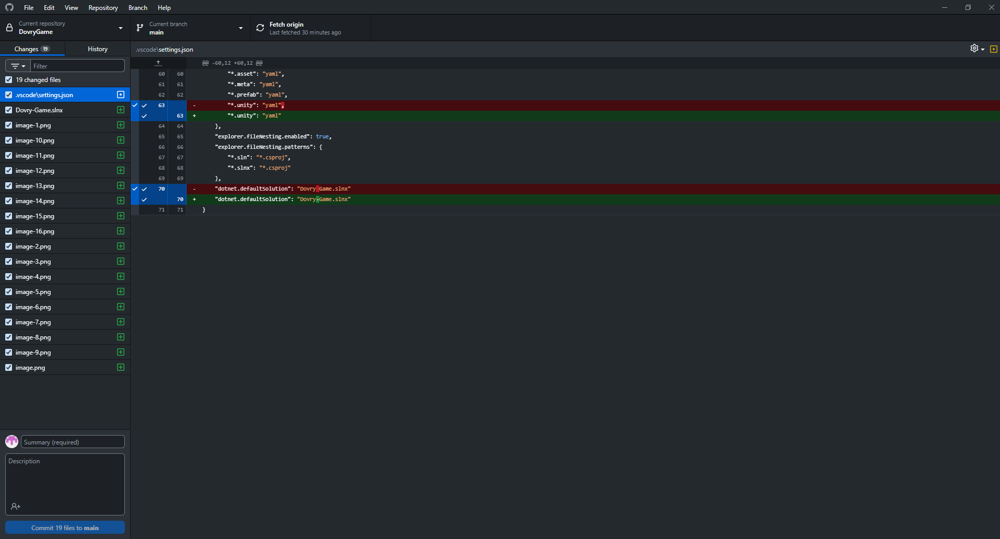

3 - Agregar el proyecto descargado a proyectos de Unity

Finalmente, queda decirle a Unity que hay un proyecto nuevo

3.1 - En Unity, desde la ventana de "Proyectos" selecciona "Añadir"

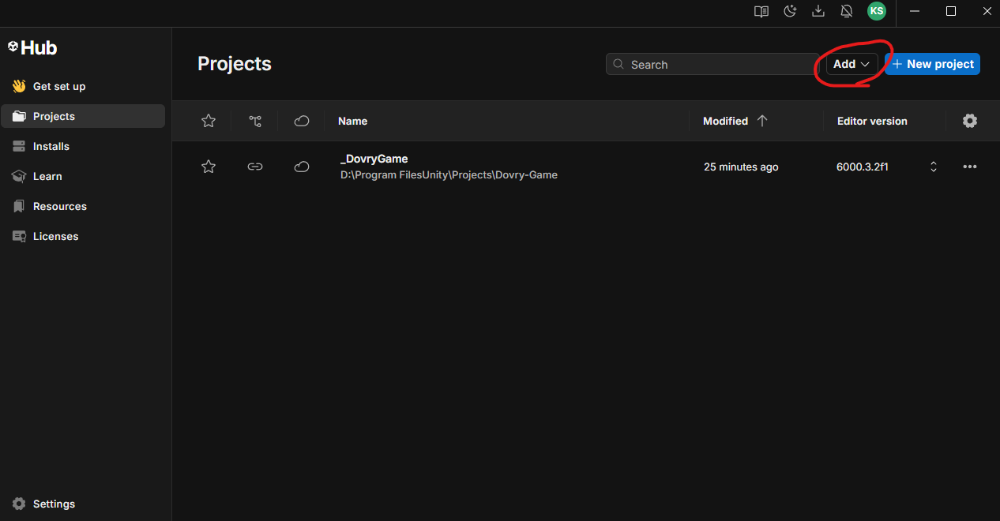

Desde ahí, seleccionar "Añadir proyecto desde el disco"

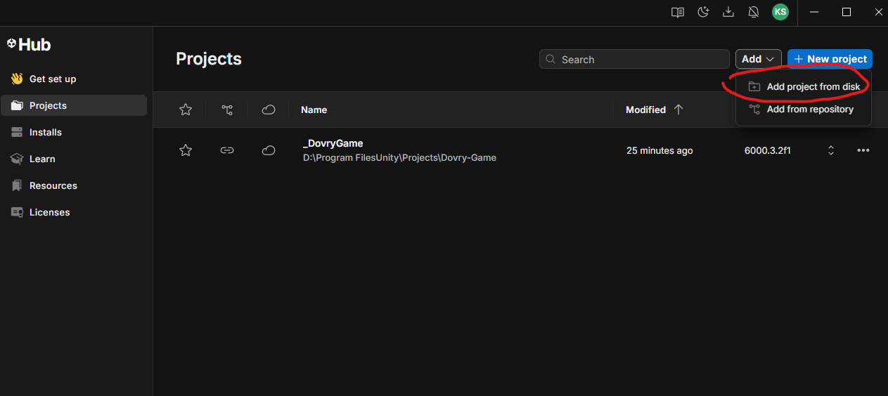

Debería abrirse la carpeta predeterminada de Unity, donde estará descargado el proyecto; basta con seleccionarlo.

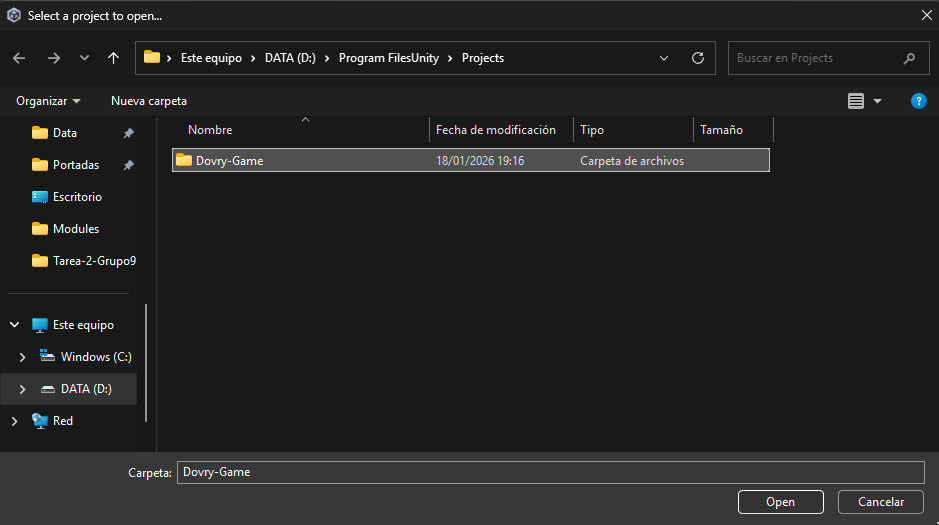

3.2 Debería haberse añadido un proyecto en la ventana de Unity; ahora solo queda instalar la versión de Unity que utiliza el proyecto. Desde la ventana Proyectos, selecciona la versión del editor del proyecto.

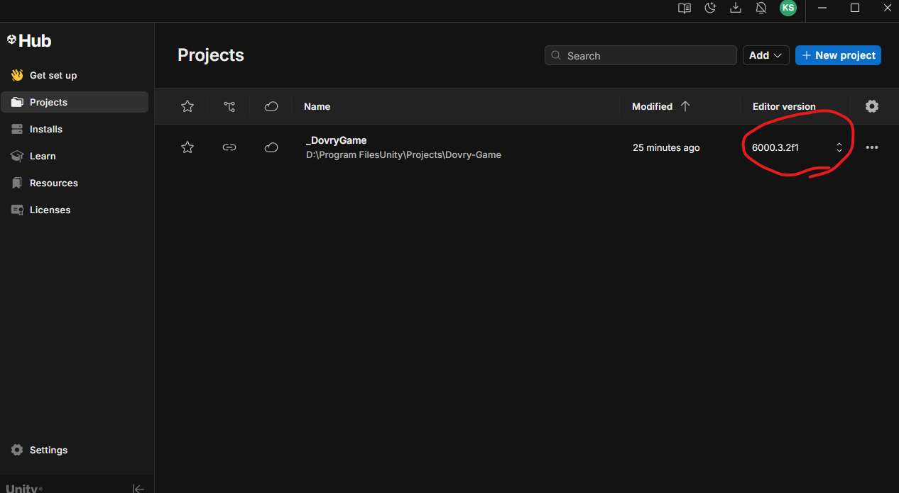

Una vez abierto, debería decir que no se posee la versión que utiliza el proyecto y debería permitir descargarla.

(No tengo referencia para este paso)

# [2.0] Iniciar el proyecto

Basta con hacer doble clic sobre el proyecto para iniciarlo. Futuras indicaciones deben ser obtenidas en persona.